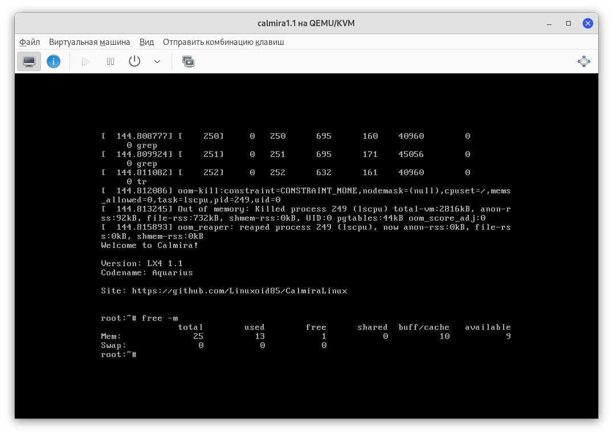

# Calmira GNU/Linux

Calmira GNU/Linux - это легковесный дистрибутив со своей пакетной базой.
Название "Calmira" было дано в честь одноимённой графической оболочки для
Win3.11.

*Рис.1: Информация о системе*

Главной особенностью системы является нетребовательность к ресурсам ПК. Для
работы будет достаточно 64 Мб ОЗУ, места на жёстком диске от 2 Гб и 64-битного
процессора типа Intel Celeron.

## Причины создания

Calmira GNU/Linux я делал только для [себя](https://github.com/Linuxoid85). Мне
нужен был неприхотливый дистрибутив Linux, ориентированный на работу в
терминале. Создавал его я для того, чтобы он работал на старом ноутбуке Asus
K50IJ. Но потом дистрибутив "вырос" в то, что есть сейчас.

## Позиционирование

Система позиционируется для опытного пользователя. Сейчас в ней есть некоторые
баги и недоработки, кроме того, в системе портов очень мало программного
обеспечения. Поэтому для постоянного использования этот дистрибутив вряд-ли
подходит. Хотя гики его могут оценить по достоинству на своих ПК.

Calmira будет полезна для изучения строения Linux. Это классический дистрибутив
Linux, который старается следовать основным стандартам: FHS и LSB.

## Идеология

Идеология системы чем-то может напоминать KISS (Keep It Simple, Stupid!). Здесь
нет усложнений и всё контролирует пользователь. Вместо systemd используется
SysVInit (не потому что продукция RedHat мне не нравится - не имею "религиозных
предрассудков"), так как у systemd имеется несколько недостатков, из-за которых
этот инит не попал в состав дистрибутива: у systemd большое число зависимостей и
большой вес инита. Он довольно сложный, а этого требуется избежать.

## Документация

У нас есть отдельный репозиторий документации, доступный
[здесь](https://github.com/CalmiraLinux/handbook). Сайт
[здесь](https://calmiralinux.github.io/handbook/site/index.html). Там
представлены сведения об установке и настройке системы.

## Системные требования

### Минимальные

| Пункт                  | Значение                       |
|:-----------------------|:-------------------------------|
| ОЗУ                    | 64 Мб                          |
| ЦП                     | Uknown Intel x86_64 >= 800 МГц |
| Место на жёстком диске | 1.5 Гб                         |

### Рекомендуемые

| Пункт                  | Значение                     |
|:-----------------------|:-----------------------------|
| ОЗУ                    | 128 Мб                       |
| ЦП                     | Uknown Intel x86_64 >= 1 ГГц |
| Место на жёстком диске | 1.5 Гб                       |

*Рис.2: тестовая версия Calmira LX4 1.1 запущена в qemu.*

> **Пометка**. Данные приблизительные. В зависимости от железа ПК они могут
> разниться. Так, например, на ноутбуке Samsung NP300E5C с 8 Гб ОЗУ система
> потребляет уже 36 Мб ОЗУ.

Однако не стоит считать, что эта система заработает на **очень** старом железе.
Во-первых, при сборке некоторого ПО может возникать ошибка вроде `Illegal
Instruction`, прерывающая процесс сборки. Это может возникать на старых ЦП
Intel/AMD. Так же эта система собирается только для архитектуры x86_64.

## Распространение

На данный момент собираются только squashfs-образы с системой. Сборка
загрузочных iso-образов пока не осуществляется. Все релизы дистрибутива доступны
[здесь](https://github.com/Linuxoid85/CalmiraLinux/releases).

## Linux, GNU/Linux или GNU/Linux-libre?

Calmira LX4 1.2 переходит на использование ядра Linux-libre, поэтому эту (и
последующие версии) стоит называть именно Calmira GNU/Linux-libre, а предыдущие
- Calmira GNU/Linux. Просто Calmira Linux - неправильно, так как Linux - всего
лишь ядро, а бОльшая часть системного ПО развивается (или развивалось ранее)
проектом GNU. Linux - это ни разу не операционная система.

## Контакты
* E-mail разработчика: <linuxoid85@gmail.com>
* Разработчик ВКонтакте: [@linuxoid85](https://vk.com/linuxoid85)
* Разработчик в Telegram: [@linuxoid85](https://t.me/linuxoid85)
